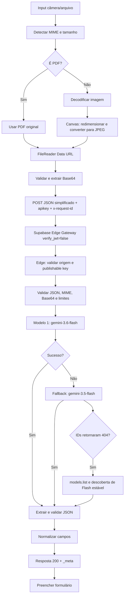

# Auditoria técnica — Controle de Obras / OCR Gemini

Data da auditoria: 2026-07-28  
Projeto analisado: conteúdo integral do ZIP enviado pelo usuário.

## 1. Resumo executivo

O HTTP 400 exibido pelo navegador não era criado pelo `fetch`, pelo Chrome, pelo CORS ou pelo parser de PDF. O frontend recebia da Edge Function um JSON de erro e, em `app.html`, apenas relançava `data.error`. A frase “Todos os modelos do Gemini falharam no momento” não existe no ZIP enviado; portanto, ela só pode ter sido produzida pela Edge Function implantada no Supabase.

O problema estrutural mais grave foi que o ZIP não continha o código-fonte dessa Edge Function. Assim, a parte que realmente chama o Gemini estava fora de controle de versão, não podia ser auditada, e reduzia todos os erros dos modelos a um único HTTP 400. Isso apagava o status e a mensagem reais do Google e impedia diferenciar modelo removido, chave inválida, cota, body incompatível ou timeout.

A correção adiciona a Edge Function completa ao repositório, usa os modelos GA atuais `gemini-3.6-flash` e `gemini-3.5-flash`, chama o endpoint REST oficial `models/{model}:generateContent` com `x-goog-api-key`, aplica saída estruturada atual com fallback de compatibilidade, valida MIME/Base64/tamanho, implementa fallback de modelos e devolve erros por etapa com `requestId` e tentativas detalhadas.

O frontend foi alterado para enviar um contrato simples e estável (`file.name`, `file.mimeType`, `file.size`, `file.data`) em vez de construir internamente o body da API do Google. O prompt, os modelos, o endpoint e a chave Gemini agora pertencem exclusivamente à Edge Function.

## 2. Estrutura e mapa de dependências

### Estrutura original encontrada

```text
controle-obras-main/
├── app.html
├── index.html
└── js/
    ├── alertas.js
    ├── app.js
    ├── config.js
    ├── database.js
    ├── equipamentos.js
    ├── exportacao.js
    ├── notificationService.js
    ├── responsaveis.js
    ├── ui.js
    └── utils.js
```

Não existiam no ZIP original:

- `supabase/config.toml`;
- `supabase/functions/gemini-ocr/index.ts`;
- código da Edge Function implantada;
- migrations SQL;
- schema do banco;
- políticas RLS;
- configuração do bucket `comprovantes`;
- arquivo de exemplo de variáveis de ambiente;
- testes automatizados.

### Dependências do painel `index.html`

```text
index.html
├── @supabase/supabase-js@2 (CDN)
├── xlsx (CDN)
├── Google Fonts / Inter
├── js/config.js
│   ├── CONFIG
│   └── State
├── js/utils.js
│   ├── Utils
│   └── DateUtils
├── js/database.js
│   └── DB -> Supabase tabela locacoes
├── js/responsaveis.js
│   └── responsaveis_obras
├── js/notificationService.js
│   └── historico_notificacoes
├── js/alertas.js
│   └── locacoes + DateUtils
├── js/ui.js
│   └── State + Utils + DateUtils
├── js/equipamentos.js
│   └── DB + Storage comprovantes + UI + App
├── js/exportacao.js
│   └── XLSX + DB + App
└── js/app.js
    └── orquestra inicialização, filtros e eventos
```

### Dependências do aplicativo móvel `app.html`

```text
app.html
├── @supabase/supabase-js@2 (CDN)
├── js/config.js
├── Supabase tabela locacoes
├── Supabase Storage bucket comprovantes
└── POST /functions/v1/gemini-ocr
    └── Edge Function Supabase
        ├── SUPABASE_PUBLISHABLE_KEYS
        ├── GEMINI_API_KEY
        └── Google Gemini Developer API
```

## 3. Fluxo OCR original

```text
input file (câmera ou arquivo)
  ↓
previewFotoEProcessarIA
  ↓
obterMimeType
  ↓
PDF: passa sem conversão
Imagem: Image + Canvas -> JPEG 1800 px / qualidade 0,84
  ↓
FileReader.readAsDataURL
  ↓
extrair Base64
  ↓
frontend cria o payload completo do generateContent
  ↓
fetch POST /functions/v1/gemini-ocr
headers: Content-Type + apikey
  ↓
Edge Function implantada, mas ausente do ZIP
  ↓
loop de modelos Gemini desconhecido
  ↓
resposta genérica HTTP 400
  ↓
app.html relança data.error
  ↓
interface mostra “Todos os modelos...”
```

Linhas originais relevantes:

- `app.html:293`: início de `chamarGeminiOCR`;
- `app.html:311-328`: frontend montava o body do Google;
- `app.html:331-339`: POST para a Edge Function;
- `app.html:349-350`: o frontend recebia HTTP não OK e relançava `data.error`.

## 4. Fluxo OCR corrigido



## 5. Problemas encontrados

### OCR / Gemini / Edge Function

1. **Código crítico ausente:** a Edge Function não existia no ZIP nem no repositório web analisado. Não havia como reproduzir, testar ou revisar a chamada Gemini.
2. **HTTP 400 sem semântica:** a função implantada convertia a falha de todos os modelos em 400. Falha de provedor deve ser 502; 400 deve representar body inválido do cliente.
3. **Erro real descartado:** modelo, status e mensagem de cada tentativa não voltavam ao navegador.
4. **Acoplamento indevido:** o frontend montava o body completo do Google. Qualquer mudança de API obrigava publicar o GitHub Pages e manter frontend e backend sincronizados.
5. **Modelos não versionados no projeto:** a lista usada pela função implantada era desconhecida. Modelos removidos podiam quebrar todos os fallbacks ao mesmo tempo.
6. **Sem validação de segredo:** o projeto não tinha verificação explícita de `GEMINI_API_KEY` ausente.
7. **Sem correlação de logs:** não existia `requestId` ponta a ponta.
8. **Sem logging por etapa:** apenas “arquivo preparado” e um erro final genérico.
9. **Sem testes:** nenhum teste de contrato, modelo alternativo, MIME, Base64, autenticação ou erro do Google.
10. **Contrato legado frágil:** a Edge aparentemente dependia de o browser enviar o payload integral do Google.

### Supabase e autenticação

11. **Migração de chave pública:** a aplicação usa `sb_publishable_...`. Esse tipo deve ser enviado no header `apikey`, não como bearer JWT. A versão corrigida mantém somente `apikey` e define `verify_jwt=false`, com validação interna.
12. **Configuração da Edge fora do Git:** não existia `supabase/config.toml`, portanto o comportamento de JWT não estava versionado.
13. **Frontend publicado inconsistente:** o branch principal online chegou a conter um placeholder no lugar da publishable key. Um novo deploy desse arquivo interromperia banco, storage e Edge Function.
14. **RLS não auditável:** não vieram migrations nem políticas das tabelas/bucket. A publishable key só é segura se as políticas RLS e Storage estiverem corretas.

### Arquivos, PDF, imagem e upload

15. **Upload silenciosamente ignorado:** o app móvel salvava o registro mesmo quando o anexo falhava; o usuário recebia sucesso sem o documento.
16. **Upload do painel também silencioso:** `equipamentos.js` ignorava `error` do Storage e continuava o insert/update.
17. **MIME/extensão incorretos no painel:** todo arquivo que não fosse PDF era renomeado para `.jpg`, mesmo PNG/WEBP.
18. **Colisão de nome:** `Date.now()` sozinho podia colidir em requisições concorrentes.
19. **Race do FileReader:** era possível salvar antes de o anexo terminar de virar Data URL.
20. **Uso desnecessário de Base64 no painel:** o arquivo era convertido para Data URL e depois reconvertido em Blob. Agora o `File` é enviado diretamente.
21. **Data UTC no Brasil:** `toISOString().split('T')[0]` podia gravar o dia seguinte/anterior conforme fuso. Foi substituído por data local.
22. **Limites incoerentes:** a mensagem antiga falava 4 MB para PDF, enquanto outros limites internos eram 12 MB. Agora cliente e Edge usam limites explícitos e compatíveis.

### Robustez e segurança geral

23. **Cache de HTML em `sessionStorage`:** o app móvel salvava opções HTML e reinjetava com `innerHTML`. Agora armazena JSON e cria nós DOM.
24. **XSS no módulo de alertas:** campos vindos do banco eram interpolados em `innerHTML` sem escape. Foram protegidos com `Utils.escapeStr`.
25. **XSS na impressão:** filtros digitados eram inseridos em `innerHTML`. Agora usa `textContent`.
26. **Loader preso em exceções:** vários fluxos escondiam o loader apenas após o `await`; uma exceção podia deixá-lo aberto. Foram adicionados `try/catch/finally`.
27. **Backup via data URL:** não escala bem para JSON grande. Foi trocado por `Blob` + `URL.createObjectURL`.
28. **Versões divergentes:** `config.js`, comentários e cache-busting exibiam 6.1, 6.2.1 e 6.2.2. Foram alinhados em 6.3.0; app móvel em 32.0.
29. **Favicon 404:** o app não definia favicon e o navegador solicitava `/favicon.ico`. Foi adicionado favicon SVG inline.
30. **Bibliotecas CDN sem versão exata:** `@supabase/supabase-js@2` e `xlsx` continuam em major/latest. É um risco residual de supply chain e regressão; recomenda-se fixar versão e SRI em uma próxima atualização controlada.

## 6. Causa raiz

### Causa direta e comprovada do HTTP 400

A Edge Function implantada executou seu fallback de modelos, não obteve sucesso e devolveu deliberadamente HTTP 400 com a mensagem “Todos os modelos do Gemini falharam no momento”. O `app.html` original, em `app.html:349-350`, apenas transformou esse JSON em `Error`. Portanto:

- não foi CORS, pois a chamada chegou à função e houve resposta JSON;
- não foi URL errada, pois o endpoint respondeu;
- não foi um erro local de `fetch`, pois existiu status HTTP 400;
- não foi o parser do formulário, pois a falha ocorreu antes de `preencherFormularioComOCR`;
- não foi upload do bucket, pois o OCR acontece antes do salvamento.

### Gatilho upstream

O código-fonte e os logs da função implantada não foram fornecidos e não estão no repositório. Por isso, não é tecnicamente possível recuperar retroativamente qual status cada modelo do Google retornou. A própria implementação eliminou essa evidência ao substituir as respostas por uma frase genérica.

O cenário temporal é compatível com IDs de modelos antigos/removidos: a documentação oficial atual lista `gemini-3.6-flash` e `gemini-3.5-flash` como estáveis, enquanto a família 2.0 foi desativada. A correção elimina essa classe de falha atualizando os modelos, adicionando descoberta automática em 404 e preservando `details.attempts`.

Assim, a causa raiz de engenharia é dupla:

1. **integração Gemini não versionada e possivelmente presa a modelos/contratos antigos**;
2. **tratamento de erro destrutivo na Edge Function, que devolvia 400 genérico e ocultava a causa upstream**.

## 7. Solução implementada

### Edge Function

- Modelos padrão: `gemini-3.6-flash`, depois `gemini-3.5-flash`.
- Endpoint oficial: `https://generativelanguage.googleapis.com/v1beta/models/{model}:generateContent`.
- Autenticação Google: `x-goog-api-key`.
- Saída estruturada atual: `generationConfig.responseFormat.text` com JSON Schema.
- Fallback para `responseMimeType: application/json` quando um modelo rejeitar formato estruturado.
- Compatibilidade com o payload simplificado e com o payload completo antigo.
- Descoberta por `models.list` se todos os IDs configurados retornarem 404.
- Validação de origem, chave Supabase, JSON, MIME, Base64, tamanho e método.
- Timeout por tentativa.
- Códigos HTTP coerentes.
- Logs JSON sem registrar arquivo Base64 nem segredos.
- `requestId` retornado em sucesso e erro.

### Frontend móvel

- Contrato reduzido a `{ requestId, file: { name, mimeType, size, data } }`.
- Header `apikey` correto; sem bearer falso.
- Validação da configuração antes de criar o cliente.
- Logs para arquivo, compressão, Base64, envio, resposta, preenchimento e falha.
- Detalhes das tentativas do Gemini exibidos no console e na mensagem de erro.
- Timeout de 75 segundos.
- Bloqueio de salvar enquanto o OCR está em andamento.
- Upload obrigatório: falha no anexo interrompe o cadastro.
- Data local e nome de arquivo aleatório.

## 8. Arquivos modificados/adicionados

### Modificados

- `app.html`
- `index.html`
- `js/config.js`
- `js/app.js` (alinhamento de versão)
- `js/database.js` (alinhamento de versão)
- `js/ui.js` (alinhamento de versão)
- `js/utils.js` (alinhamento de versão)
- `js/equipamentos.js`
- `js/exportacao.js`
- `js/alertas.js`

### Adicionados

- `.gitignore`
- `supabase/config.toml`
- `supabase/functions/.env.example`
- `supabase/functions/gemini-ocr/index.ts`
- `supabase/functions/gemini-ocr/core.js`
- `tests/ocr-core.test.mjs`
- `README_OCR_DEPLOY.md`
- `AUDITORIA_OCR.md`

## 9. Antes x depois

| Área | Antes | Depois |
|---|---|---|
| Código da Edge | Ausente do projeto | Versionado em `supabase/functions/gemini-ocr` |
| Body do frontend | Payload interno do Google | Contrato simples de arquivo |
| Modelos | Desconhecidos | 3.6 Flash + 3.5 Flash + descoberta em 404 |
| API Google | Não auditável | Endpoint REST oficial e header oficial |
| Erro de todos os modelos | HTTP 400 genérico | HTTP 502 + tentativas detalhadas |
| JSON inválido do cliente | Misturado com falhas do provedor | HTTP 400 específico |
| Auth Supabase | Sem config versionada | `apikey`, `verify_jwt=false`, validação interna |
| Logs | Poucos e sem correlação | Etapas + `requestId` ponta a ponta |
| Upload com erro | Cadastro continuava sem anexo | Operação interrompida com erro explícito |
| Data | UTC truncado | Data local |
| Testes | Nenhum | 8 testes automatizados |

## 10. Validação executada

Foram executados localmente:

```text
node --check em todos os arquivos JavaScript: aprovado
parse dos scripts inline de app.html e index.html: aprovado
node tests/ocr-core.test.mjs: 8 testes aprovados
```

Os testes usam respostas simuladas da Gemini API para validar o comportamento determinístico sem consumir a chave ou cota do usuário.

Não foi possível executar uma chamada real ao Gemini porque o ZIP não contém `GEMINI_API_KEY`, e não foi fornecido acesso autenticado ao projeto Supabase para publicar a função ou ler seus logs privados. Portanto, a validação de produção exige o deploy descrito em `README_OCR_DEPLOY.md`.

## 11. Critério objetivo de confirmação em produção

O OCR estará confirmado quando, após o deploy:

1. o health check informar `geminiKeyConfigured: true`;
2. o POST retornar HTTP 200;
3. a resposta contiver os cinco campos e `_meta.model`;
4. o console mostrar `ocr_concluido`;
5. os logs da função mostrarem `gemini_request_succeeded` e `ocr_completed` para o mesmo `requestId`.

Se ainda houver falha, a resposta corrigida apresentará exatamente o modelo, o HTTP do Google e a mensagem upstream em `details.attempts`; não haverá mais o erro genérico sem diagnóstico.

## 12. Fontes oficiais usadas na atualização

- Gemini API reference: `https://ai.google.dev/api/generate-content`
- Gemini 3.6 Flash: `https://ai.google.dev/gemini-api/docs/models/gemini-3.6-flash`
- Gemini 3.5 Flash: `https://ai.google.dev/gemini-api/docs/models/gemini-3.5-flash`
- Gemini structured output: `https://ai.google.dev/gemini-api/docs/generate-content/structured-output`
- Supabase API key migration: `https://supabase.com/docs/guides/getting-started/migrating-to-new-api-keys`
- Supabase Edge Function secrets: `https://supabase.com/docs/guides/functions/secrets`
- Supabase authorization headers: `https://supabase.com/docs/guides/functions/auth-headers`
